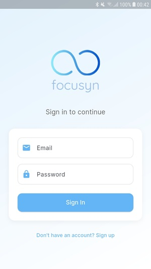
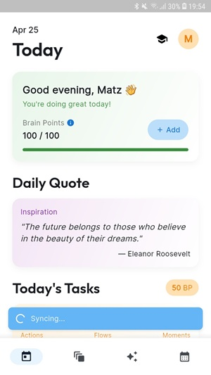
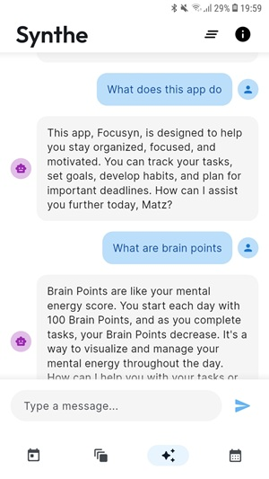

# Focusyn

**Focusyn** is a modern productivity and focus management app built with Flutter. It helps you stay on track, manage mental energy, and grow focus habits through a calm, minimal UI — powered by task planning, streak tracking, and an AI assistant named Synthe.

## Coursework Details

- **Course**: IN3007 Individual Project
- **Institution**: City, University of London
- **Term**: Spring 2025

## Features

### Core Features
- **Task Management**: Organize tasks into Actions, Flows, Moments, and Thoughts
- **Brain Points**: Track your mental energy levels throughout the day
- **Progress Tracking**: Monitor your focus streaks and weekly progress
- **AI Assistance**: Get personalized productivity insights and recommendations

### User Experience
- **Clean Interface**: Modern, intuitive UI with light/dark theme support
- **Onboarding**: Guided first-time user experience
- **Cloud Sync**: Automatic synchronization of your data
- **Responsive Design**: Works seamlessly across different screen sizes

## Screenshots

### Sign In


### Dashboard


### Synthe AI


## Getting Started

### Prerequisites
- Flutter SDK (latest stable version)
- Firebase account
- Android Studio / VS Code with Flutter extensions

### Installation

1. Clone the repository:
```bash
git clone https://github.com/yourusername/focusyn_app.git
cd focusyn_app
```

2. Install dependencies:
```bash
flutter pub get
```

3. Configure Firebase:
   - Create a new Firebase project
   - Add Android and iOS apps to your Firebase project
   - Download and add the configuration files:
     - `google-services.json` for Android
     - `GoogleService-Info.plist` for iOS

4. Run the app:
```bash
flutter run
```

## Project Structure

```
lib/
├── constants/        # Keys, icons, quotes, theme values
├── init/             # App + Hive + Firebase initialization
├── models/           # Data models (e.g. Task)
├── pages/            # UI screens (Today, Focuses, AI, etc.)
├── services/         # Logic (AI, notifications, sync)
├── task_dialogs/     # Task entry dialogs
├── task_tiles/       # Task display widgets
├── theme/            # App theme config
└── utils/            # Common helpers and extensions
```

### Key Components

- **Main Screen**: Root container with bottom navigation
- **Today Page**: Daily tasks and progress overview
- **Focuses Page**: Focus session management
- **AI Page**: AI-powered assistance
- **Planner Page**: Task planning and organization
- **Login Page**: User authentication
- **Onboarding Page**: First-time user experience

## Data Management

The app uses:
- **Firebase Authentication**: For user management
- **Hive**: For local storage
- **Cloud Firestore**: For cloud synchronization
- **Brain Points System**: For tracking mental energy

## Testing

Run all unit tests:

```bash
flutter test
```
Use hive_test and mockito for mocking storage and services.

## Contributing

1. Fork the repository
2. Create your feature branch (`git checkout -b feature/amazing-feature`)
3. Commit your changes (`git commit -m 'Add some amazing feature'`)
4. Push to the branch (`git push origin feature/amazing-feature`)
5. Open a Pull Request

## License

This project is licensed under the MIT License - see the [LICENSE](LICENSE) file for details.

## Acknowledgments

- Firebase – for auth and sync
- OpenAI – powering Synthe
- DesignEvo – for logo creation
- ChatGPT – for helpful guidance in development


